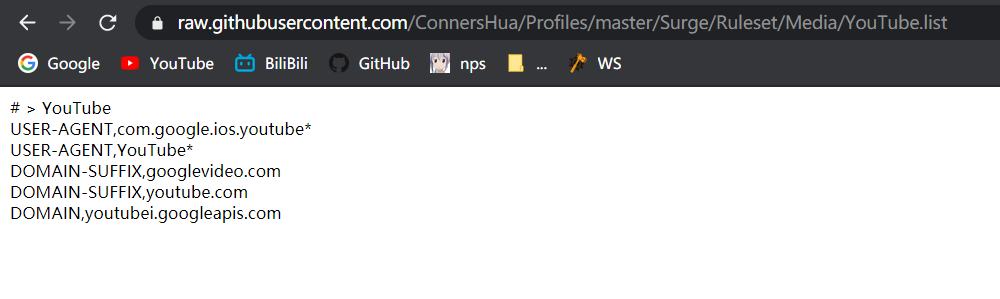
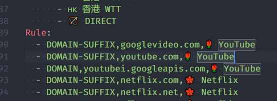
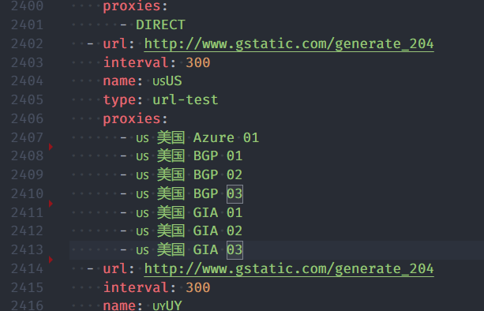

# subconverter

在各种订阅格式之间进行转换的实用程序.

[](https://travis-ci.com/tindy2013/subconverter)

- [subconverter](#subconverter)
  - [支持类型](#支持类型)
  - [用法](#用法)
      - [旧接口](#旧接口)
  - [**推荐阅读**](#推荐阅读)
  - [pref.ini](#prefini)
    - [common](#common)
      - [api_mode](#api_mode)
      - [default_url](#default_url)
      - [exclude_remarks](#exclude_remarks)
      - [include_remarks](#include_remarks)
      - [clash_rule_base](#clash_rule_base)
      - [surge_rule_base](#surge_rule_base)
      - [surfboard_rule_base](#surfboard_rule_base)
      - [rename_node](#rename_node)
    - [managed_config](#managed_config)
    - [emojis](#emojis)
    - [ruleset](#ruleset)
    - [clash_proxy_group](#clash_proxy_group)
    - [server](#server)
      - [listen](#listen)
      - [port](#port)
    - [advanced](#advanced)
  - [gist](#gist)


## 支持类型

| 类型         | 作为源类型 | 作为目标类型 | 参数        |
| ------------ | :--------: | :----------: | ----------- |
| clash        |     ✔      |      ✔       | clash       |
| clashr       |     ✔      |      ✔       | clashr      |
| surge2       |     ✔      |      ✔       | surge?ver=2 |
| surge3       |     ✔      |      ✔       | surge?ver=3 |
| surge4       |     ✔      |      ✔       | surge?ver=4 |
| quantumult   |     ✔      |      ✔       | quan        |
| quantumult X |     ✔      |      ✔       | quanx       |
| surfboard    |     ✔      |      ✔       | surfboard   |
| ss           |     ✔      |      ✔       | ss          |
| ssr          |     ✔      |      ✔       | ssr         |
| ssd          |     ✔      |      ✔       | ssd         |
| v2ray        |     ✔      |      ✔       | v2ray       |


## 用法

```
http://127.0.0.1:25500/sub?target=clash&url=%URL_ENCODED_LINKS%

http://127.0.0.1:25500/sub?target=surge&ver=4&url=%URL_ENCODED_LINKS%

http://127.0.0.1:25500/sub?target=v2ray&url=%URL_ENCODED_LINKS%
```

#### 旧接口

```
http://127.0.0.1:25500/clash?url=%URL_ENCODED_LINKS%
```

如果你有多个订阅, 在url encode之前使用 '|' 来分隔链接. <br>

e.g. <br>
> 我有以下两个订阅: <br>
`https://dler.cloud/subscribe/ABCDE?clash=vmess`
`https://rich.cloud/subscribe/ABCDE?clash=vmess`
<br> <br>
使用'|'分隔: <br>
`https://dler.cloud/subscribe/ABCDE?clash=vmess|https://rich.cloud/subscribe/ABCDE?clash=vmess`
<br> <br>
url encode后: <br>
`https%3A//dler.cloud/subscribe/ABCDE%3Fclash%3Dvmess%7Chttps%3A//rich.cloud/subscribe/ABCDE%3Fclash%3Dvmess`
<br> <br>
添加到链接后面: <br>
`http://127.0.0.1:25500/sub?target=clash&url=https%3A//dler.cloud/subscribe/ABCDE%3Fclash%3Dvmess%7Chttps%3A//rich.cloud/subscribe/ABCDE%3Fclash%3Dvmess`
<br> <br>
&nbsp;&nbsp;&#127830; 食用 &#127830;
<br> <br>


- 想学更多姿势? 来瞅瞅[pref.ini](./pref.ini).


## **推荐阅读**

> - [&#128220; 正则表达式 &#128220;](https://zh.wikipedia.org/zh-hans/%E6%AD%A3%E5%88%99%E8%A1%A8%E8%BE%BE%E5%BC%8F)
> - [&#128221; yaml语法介绍 &#128221;](https://zh.wikipedia.org/wiki/YAML#%E8%AA%9E%E6%B3%95)
> - [&#10068; 提问的智慧 &#10068;](https://github.com/ryanhanwu/How-To-Ask-Questions-The-Smart-Way/blob/master/README-zh_CN.md)


## pref.ini

### common

#### api_mode

> API模式，设置为true以防止直接加载本地订阅或直接提供本地文件.

当值为`false`时, 每次更新配置都会读取`pref.ini`, 为`true`时则仅启动时读取.


#### default_url

> 无url参数时默认链接. 如果有多个链接, 使用 "|" 分隔, 支持`文件`/`url`.

这种用法:
```ini
default_url=https://dler.cloud/subscribe/ABCDE?clash=vmess
```

`http://127.0.0.1:25500/clash`

相当于:
<br>
`http://127.0.0.1:25500/sub?target=clash&url=https%3A//dler.cloud/subscribe/ABCDE%3Fclash%3Dvmess`


#### exclude_remarks

> 排除匹配到的节点, 支持正则.

e.g.
```ini
exclude_remarks=(流量|时间|官网|产品)
```


#### include_remarks

> 仅保留匹配到的节点, 支持正则.

e.g.
```ini
include_remarks=(?<=美).*(BGP|GIA|IPLC)
```


#### clash_rule_base

> 生成的clash配置文件基础. 支持`文件`/`url`.

e.g.
```ini
clash_rule_base=clash.yaml

clash_rule_base=https://raw.githubusercontent.com/ConnersHua/Profiles/master/Clash/Pro.yaml
```


#### surge_rule_base

> 生成的surge配置文件基础. 用法同上.


#### surfboard_rule_base

> 生成的surfboard配置文件基础. 用法同上.


#### rename_node

> 重命名节点, 支持正则.

e.g.
```ini
rename_node=中国@中
rename_node=深圳@深
```


### managed_config

> 将'＃！MANAGED-CONFIG'信息附加到Surge配置.


### emojis

> 添加识别到的第一个国家国旗在节点名称前, 支持正则.

e.g.
```ini
rule=(流量|时间|应急),⌛time
rule=(美|美国|United States),🇺🇸
```


### ruleset

> 规则片段.

e.g.


```ini
ruleset=🌹 YouTube,https://raw.githubusercontent.com/ConnersHua/Profiles/master/Surge/Media/YouTube.list
```

效果图:




### clash_proxy_group

> clash的策略组, 可用正则来筛选节点.

e.g.
```ini
custom_proxy_group=🇺🇸US`url-test`(美|美国|United States)`http://www.gstatic.com/generate_204`300
```

效果图:




ssr/v2订阅默认没有组名, 可以使用这个方法来添加组名.

```ini
custom_proxy_group=g1`select`!!GROUPID=0
custom_proxy_group=g2`select`!!GROUPID=1
custom_proxy_group=v2ray`select`!!GROUP=V2RayProvider
```


### server

#### listen

> 绑定到Web服务器的地址, 将地址设为0.0.0.0, 则局域网内设备均可使用.

#### port

> 绑定到Web服务器地址的端口.


### advanced

> 无需描述.


## gist

> 自动上传gist.

在[gistconf.ini](./gistconf.ini)中添加personal access token, 在链接后加上`upload=true`就会在更新好后自动上传gist.