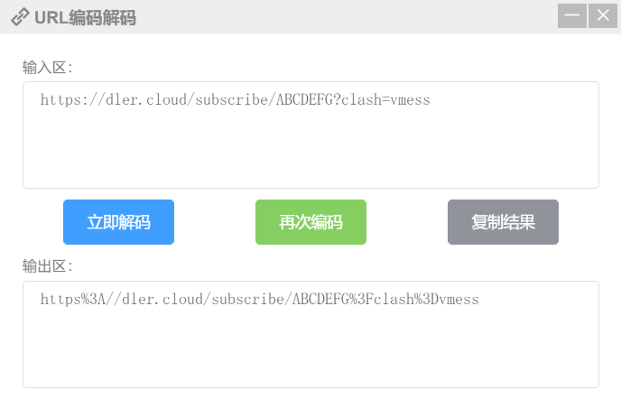

# subconverter
Utility to convert between various subscription format
[](https://travis-ci.com/tindy2013/subconverter)

<br>

## Usage

### link
```
http://127.0.0.1:25500/clash?url=%URL_ENCODED_LINKS%
```
* Use '|' to separate multiple links before URL Encode.  
* For more preference options, please check pref.ini.
 
url encode like this: <br> <br> 
 
<br>

## &#160;&#160; <span style="color: coral;"> pref.ini </span>

<br>

#### api_mode

> API模式，设置为true以防止直接加载本地订阅或直接提供本地文件

当值为`false`时, 每次更新配置都会读取`pref.ini`, 为`true`时则仅启动时读取.

<br>

#### default_url

> 无url参数时默认链接

这种用法:  
```ini
default_url=https://dler.cloud/subscribe/ABCDE?clash=vmess
```

`127.0.0.1:25500/clash`


相当于:

`127.0.0.1:25500/clash?url=https%3A//dler.cloud/subscribe/ABCDE%3Fclash%3Dvmess`


如果你只有一个链接推荐这样使用, 当然, 多个链接也可以.  (虽然还是很麻烦...

<br>

#### exclude_remarks

> 排除节点, 支持正则.

e.g.
```ini
exclude_remarks=(流量|时间|官网|产品)
```

<br>

#### include_remarks

> 与上相反.

e.g.
```ini
exclude_remarks=(?<=美)(BGP|GIA|IPLC)
```

<br>

#### clash_rule_base

> 生成的clash配置文件基础. 支持文件/url.

e.g.
```ini
clash_rule_base=base.yml

clash_rule_base=https://raw.githubusercontent.com/ConnersHua/Profiles/master/Clash/Pro.yaml
```

<br>

#### surge_rule_base

> 生成的surge配置文件基础. 用法同上.

<br>

#### rename_node

> 重命名节点, 支持正则.

e.g.
```ini
rename_node=中国@中
rename_node=深圳@深
```

<br>

#### managed_config

> 将'＃！MANAGED-CONFIG'信息附加到Surge配置. `true` is okay.

<br>

#### emojis

> 添加识别到的第一个国家国旗在节点名称前. 当然, 支持正则.

e.g.
```ini
rule=(流量|时间|应急),⌛🇹🇮🇲🇪
rule=(美|美国|United States),🇺🇸
```

<br>

#### ruleset

> 规则片段.

e.g.
 

 
```ini
ruleset=🌹 YouTube,https://raw.githubusercontent.com/ConnersHua/Profiles/master/Surge/Media/YouTube.list
```

效果如图:
 

 
<br>

#### clash_proxy_group

> clash的策略组, 可用正则来筛选节点.

e.g.
```ini
custom_proxy_group=🇺🇸US`url-test`(美|美国|United States)`http://www.gstatic.com/generate_204`300
```

效果图:  
 

 
<br>

#### server

> 开启服务的地址, 开在0.0.0.0, 则局域网内设备均可使用.

<br>

#### advanced

> no need description.

<br>

## support type

| type         | as source | as target | argument    |
| ------------ | --------- | --------- | ----------- |
| clash        | ✔         | ✔         | clash       |
| clashr       | ✔         | ✔         | clashr      |
| surge2       | ✔         | ✔         | surge?ver=2 |
| surge3       | ✔         | ✔         | surge?ver=3 |
| surge4       | ✔         | ✔         | surge?ver=4 |
| surfboard    | ✔         | ✔         | surfboard   |
| quantumult   | ✔         | ✔         | quan        |
| quantumult X | ✔         | ✔         | quanx       |
| ss           | ✔         | ✔         | ss          |
| ssr          | ✔         | ✔         | ssr         |
| ssd          | ✔         | ✔         | ssd         |
| v2ray        | ✔         | ✔         | v2ray       |
