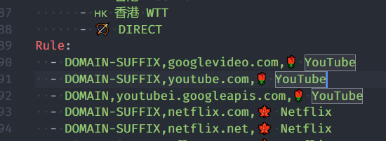
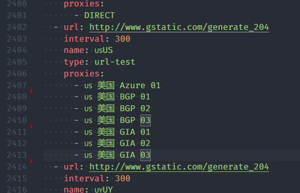

# subconverter

Utility to convert between various subscription format.

[](https://travis-ci.com/tindy2013/subconverter)

[中文文档](./README-cn.md)

- [subconverter](#subconverter)
  - [Support Type](#support-type)
  - [Usage](#usage)
      - [Old interface](#old-interface)
  - [**Recommended reading**](#recommended-reading)
  - [pref.ini](#prefini)
    - [common](#common)
      - [api_mode](#api_mode)
      - [default_url](#default_url)
      - [exclud_remarks](#exclud_remarks)
      - [include_remarks](#include_remarks)
      - [clash_rule_base](#clash_rule_base)
      - [surge_rule_base](#surge_rule_base)
      - [surfboard_rule_base](#surfboard_rule_base)
      - [rename_node](#rename_node)
    - [managed_config](#managed_config)
    - [emojis](#emojis)
    - [ruleset](#ruleset)
    - [clash_proxy_group](#clash_proxy_group)
    - [server](#server)
      - [listen](#listen)
      - [port](#port)
    - [advanced](#advanced)
  - [gist](#gist)


## Support Type

| Type         | As Source Type | As Target Type | Parameters  |
| ------------ | :------------: | :------------: | ----------- |
| clash        |       ✔        |       ✔        | clash       |
| clashr       |       ✔        |       ✔        | clashr      |
| surge2       |       ✔        |       ✔        | surge?ver=2 |
| surge3       |       ✔        |       ✔        | surge?ver=3 |
| surge4       |       ✔        |       ✔        | surge?ver=4 |
| quantumult   |       ✔        |       ✔        | quan        |
| quantumult X |       ✔        |       ✔        | quanx       |
| surfboard    |       ✔        |       ✔        | surfboard   |
| ss           |       ✔        |       ✔        | ss          |
| ssr          |       ✔        |       ✔        | ssr         |
| ssd          |       ✔        |       ✔        | ssd         |
| v2ray        |       ✔        |       ✔        | v2ray       |


## Usage

```
http://127.0.0.1:25500/sub?target=clash&url=%URL_ENCODED_LINKS%

http://127.0.0.1:25500/sub?target=surge&ver=4&url=%URL_ENCODED_LINKS%

http://127.0.0.1:25500/sub?target=v2ray&url=%URL_ENCODED_LINKS%
```

#### Old interface

```
http://127.0.0.1:25500/clash?url=%URL_ENCODED_LINKS%
```

If you have multiple subscriptions, use '|' to separate the links before url encode. <br>

e.g. <br>
> I have the following two subscriptions: <br>
`https://dler.cloud/subscribe/ABCDE?clash=vmess`
`https://rich.cloud/subscribe/ABCDE?clash=vmess`
<br> <br>
separated by '|': <br>
`https://dler.cloud/subscribe/ABCDE?clash=vmess|https://rich.cloud/subscribe/ABCDE?clash=vmess`
<br> <br>
after url encode: <br>
`https%3A//dler.cloud/subscribe/ABCDE%3Fclash%3Dvmess%7Chttps%3A//rich.cloud/subscribe/ABCDE%3Fclash%3Dvmess`
<br> <br>
add to the back of the link: <br>
`http://127.0.0.1:25500/sub?target=clash&url=https%3A//dler.cloud/subscribe/ABCDE%3Fclash%3Dvmess%7Chttps%3A//rich.cloud/subscribe/ABCDE%3Fclash%3Dvmess `
<br> <br>
&nbsp;&nbsp;&#127830; Edible &#127830;
<br> <br>


- Want to learn more postures? Come to [pref.ini](./pref.ini).


## **Recommended reading**

> - [&#128220; Regular Expression &#128220;](https://en.wikipedia.org/wiki/Regular_expression)
> - [&#128221; yaml syntax introduction &#128221;](https://en.wikipedia.org/wiki/YAML)
> - [&#10068; Wisdom to ask questions &#10068;](http://www.catb.org/~esr/faqs/smart-questions.html)


## pref.ini

### common

#### api_mode

> API mode, set to true to prevent loading local subscriptions or serving local files directly.

When the value is `false`, `pref.ini` is read every time the configuration is updated. When it is `true`, it is read only at startup.


#### default_url

> Default URLs, used when no URL is provided in request, use "|" to separate multiple subscription links, supports local files/URL.

This usage:
```ini
default_url=https://dler.cloud/subscribe/ABCDE?clash=vmess
```

`http://127.0.0.1:25500/clash`

equivalent to:
<br>
`http://127.0.0.1:25500/sub?target=clash&url=https%3A//dler.cloud/subscribe/ABCDE%3Fclash%3Dvmess`


#### exclud_remarks

> Exclude nodes which remarks match the following patterns. Supports regular expression.

e.g.
```ini
exclude_remarks=(Traffic|Time|Official Website|Products)
```


#### include_remarks

> Only include nodes which remarks match the following patterns. Supports regular expression.

e.g.
```ini
include_remarks=(?<=美).*(BGP|GIA|IPLC)
```


#### clash_rule_base

> Clash config base used by the generator, supports local `files`/`URL`.

e.g.
```ini
clash_rule_base=clash.yaml

clash_rule_base=https://raw.githubusercontent.com/ConnersHua/Profiles/master/Clash/Pro.yaml
```


#### surge_rule_base

> Surge config base used by the generator, supports local `files`/`URL`.


#### surfboard_rule_base

> Surfboard config base used by the generator, supports local `files`/`URL`.


#### rename_node

> Rename remarks with the following patterns. Supports regular expression.

e.g.
```ini
rename_node=中国@中
rename_node=深圳@深
```


### managed_config

> Append a '#!MANAGED-CONFIG' info to Surge configurations.


### emojis

> Rule to add emojis. Supports regular expression.

e.g.
```ini
rule=(流量|时间|应急),⌛time
rule=(美|美国|United States),🇺🇸
```


### ruleset

> Enable generating rules with rulesets.

e.g.


```ini
ruleset=🌹 YouTube, https://raw.githubusercontent.com/ConnersHua/Profiles/master/Surge/Media/YouTube.list
```

effect chart:




### clash_proxy_group

> Generate Clash Proxy Group with the following patterns. Node filterting rule supports regular expression.

e.g.
```ini
custom_proxy_group=🇺🇸US`url-test`(United States|United States|United States)`http://www.gstatic.com/generate_204`300
```

effect chart:




The ssr/v2 subscription does not have a group name by default. You can use this method to add a group name.

```ini
custom_proxy_group=g1`select`!!GROUPID=0
custom_proxy_group=g2`select`!!GROUPID=1
custom_proxy_group=v2ray`select`!!GROUP=V2RayProvider
```


### server

#### listen

> Address to bind on for Web Server.

#### port

> Port to bind on for Web Server.


### advanced

> No description required.


## gist

> Automatically upload gist.

Add personal access token in [gistconf.ini](./gistconf.ini), add `upload=true` after the link will automatically upload gist after updating.